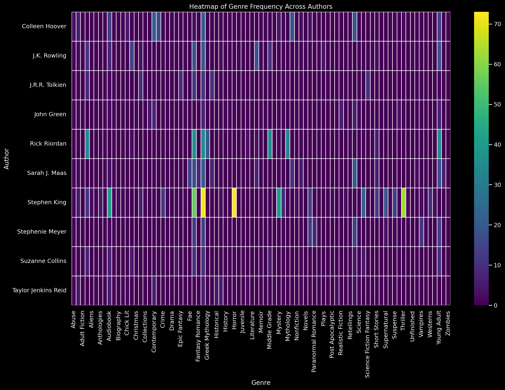
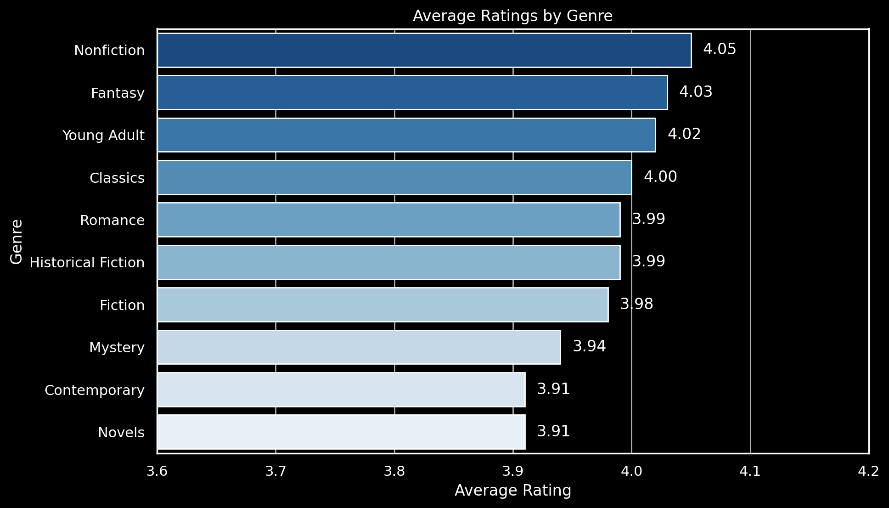

# Introduction
In the digital age, books have expanded into vast online repositories with millions of reviews and ratings. SQL_Project_BookInsight_Analyzing_Book_Reviews_and_Ratings leverages SQL to process, analyze, and visualize this data, uncovering patterns and trends in literary preferences, author popularity, and genre insights.

SQL query? Check them out here: [project_sql folder](/project_sql/)

# Background
In the digital age, understanding reader preferences and trends in the book industry is crucial. This project, **SQL_Project_BookInsight_Analyzing_Book_Reviews_and_Ratings**, was initiated to explore the vast amount of data generated from book reviews and ratings, aiming to uncover insights into author popularity, genre preferences, and top-rated books.

The data used in this project comes from [kaggle: Goodreads-books](https://www.kaggle.com/datasets/jealousleopard/goodreadsbooks). It includes information on authors, book titles, genres, and user ratings.

### The key questions addressed through SQL queries in this project are:

1. Who are the most published authors?
2. Which books have the highest ratings?
3. Who are the authors with the highest average ratings?
4. What are the genre statistics for top-rated authors?
5. Which genres are the most popular and highly rated?

# Tools I Used

For my deep dive into the world of book reviews and ratings, I utilized several key tools:

- **SQL:** The core tool for querying the database, enabling detailed analysis of book data.
- **PostgreSQL:** The database management system used to store and manage the extensive book review and rating data.
- **Visual Studio Code:** My primary environment for database management and executing SQL queries.
- **Git & GitHub:** Crucial for version control and sharing my SQL scripts and analysis, facilitating collaboration and project tracking.

# The Analysis
### 1. Who are the most published authors?
To identify the most prolific authors, I filtered the dataset to list authors by the number of books published. This query highlights the top authors with the highest number of publications.

```sql
WITH author_publications AS (
    SELECT
        author,
        COUNT(DISTINCT book_id) AS num_books
    FROM
        book_details
    GROUP BY
        author
)
SELECT
    author,
    num_books
FROM
    author_publications
ORDER BY
    num_books DESC
LIMIT 10;
```

Here's the breakdown of the most published authors:
- **Most Published Author:**
    - **Stephen King**, with a total of 74 books.
- **Common Authors and Number of Books Published:**
    - **Danielle Steel** follows with 47 books.
    - **Agatha Christie** and **Sylvia Browne** have published 45 and 43 books respectively.
- **Frequent Authors:**
    - Authors like **Stephen King**, **Danielle Steel**, and **Agatha Christie** have consistently published a large number of books, highlighting their prolific writing careers.


*This bar chart shows the authors with the most books published. Each bar displays author names and the number of books they have published, ranging from 42 to 74*
### 2. Which books have the highest ratings?
To understand which books have the highest ratings, I analyzed a dataset containing book titles, authors, number of ratings, and average ratings. This provides insights into the most popular and well-regarded books based on reader feedback.

```sql
WITH avg_num_ratings AS (
    SELECT AVG(num_ratings) AS avg_ratings
    FROM book_details
),
deduplicated_books AS (
    SELECT
        book_id,
        book_title,
        publication_info,
        author,
        num_ratings,
        num_reviews,
        average_rating,
        publication_date,
        ROW_NUMBER() OVER (PARTITION BY book_title ORDER BY num_ratings DESC) AS rn
    FROM
        book_details
)

SELECT
    book_title,
    author,
    num_ratings,
    average_rating
FROM
    deduplicated_books
WHERE
    rn = 1
    AND num_ratings > (SELECT avg_ratings FROM avg_num_ratings)
ORDER BY
    average_rating DESC
LIMIT 10;
```
Here's the breakdown of the highest-rated books based on the dataset:
- **Words of Radiance** by Brandon Sanderson with an average rating of 4.76 from 355,368 ratings
- **Harry Potter Series Box Set** by J.K. Rowling with an average rating of 4.74 from 288,478 ratings
- **Harry Potter Boxed Set, Books 1-5** by J.K. Rowling with an average rating of 4.72 from 148,443 ratings
- **Know My Name** by Chanel Miller with an average rating of 4.71 from 202,602 ratings
- **Kingdom of Ash** by Sarah J. Maas with an average rating of 4.69 from 566,523 ratings
- **The Way of Kings** by Brandon Sanderson with an average rating of 4.66 from 500,546 ratings

| Book Title                                                                | Author            | Number of Ratings | Average Rating |
| ------------------------------------------------------------------------- | ----------------- | ----------------- | -------------- |
| Words of Radiance                                                         | Brandon Sanderson | 355,368           | 4.76           |
| Harry Potter Series Box Set                                               | J.K. Rowling      | 288,478           | 4.74           |
| Harry Potter Boxed Set, Books 1-5                                         | J.K. Rowling      | 148,443           | 4.72           |
| Know My Name                                                              | Chanel Miller     | 202,602           | 4.71           |
| Kingdom of Ash                                                            | Sarah J. Maas     | 566,523           | 4.69           |
| El camino de los reyes                                                    | Brandon Sanderson | 500,807           | 4.66           |
| The Way of Kings                                                          | Brandon Sanderson | 500,546           | 4.66           |
| The Essential Calvin and Hobbes: A Calvin and Hobbes Treasury             | Bill Watterson    | 121,178           | 4.65           |
| Manacled                                                                  | SenLinYu          | 83,579            | 4.65           |
| A Court of Mist and Fury                                                  | Sarah J. Maas     | 1,956,057         | 4.65           |
*Table of the top 10 highest ratings books*

### 3. Who are the authors with the highest average ratings?
This analysis identifies the authors with the highest average ratings, showcasing those who have received consistent positive feedback from readers.
```sql
WITH AuthorTotalRatings AS (
    SELECT
        author,
        SUM(num_ratings) AS total_num_ratings
    FROM
        book_details
    GROUP BY
        author
    ORDER BY
        total_num_ratings DESC
    LIMIT 35
),
AvgTotalNumRating AS (
    SELECT
        ROUND(AVG(total_num_ratings), 2) AS avg_total_num_ratings
    FROM
        AuthorTotalRatings
),
AuthorRatings AS (
    SELECT
        author,
        ROUND(AVG(average_rating), 2) AS avg_rating,
        ROUND(AVG(num_ratings), 2) AS avg_num_ratings
    FROM
        book_details
    GROUP BY
        author
),
TopAuthors AS (
    SELECT
        ar.author,
        ar.avg_rating
    FROM 
        AuthorRatings AS ar
    INNER JOIN 
        AvgTotalNumRating AS atnr
    ON 
        (SELECT SUM(num_ratings) FROM book_details WHERE author = ar.author) > atnr.avg_total_num_ratings
    ORDER BY 
        ar.avg_rating DESC
    LIMIT 10
)

SELECT
    ta.author,
    ta.avg_rating
FROM
    TopAuthors AS ta
ORDER BY 
    ta.avg_rating DESC;
```
Here's the breakdown of the top authors by average rating:

- **Sarah J. Maas** leads with an impressive average rating, reflecting her popularity and the positive reception of her works.

- **Rick Riordan** and **J.K. Rowling** follow closely, both being well-known for their engaging storytelling and beloved series.

- **J.R.R. Tolkien** maintains a high rating, indicative of the timeless appeal of his classic fantasy works.

- **Taylor Jenkins Reid** rounds out the top five, known for her contemporary fiction that resonates with many readers.

| Author               | Average Rating |
| -------------------- | -------------- |
| Sarah J. Maas        | 4.39           |
| Rick Riordan         | 4.31           |
| J.K. Rowling         | 4.29           |
| J.R.R. Tolkien       | 4.29           |
| Taylor Jenkins Reid  | 4.23           |
| Suzanne Collins      | 4.22           |
| Colleen Hoover       | 4.03           |
| Stephen King         | 4.00           |
| John Green           | 3.87           |
| Stephenie Meyer      | 3.81           |
*Table of the top 10 authors with the highest average ratings*
### 4. What are the genre statistics for top-rated authors?
To identify the top-rated authors in various genres, I filtered the data to show the number of books each author has in different genres. This query highlights the most prolific authors and their dominance in specific genres.
```sql
WITH AuthorTotalRatings AS (
    SELECT
        author,
        SUM(num_ratings) AS total_num_ratings
    FROM
        book_details
    GROUP BY
        author
    ORDER BY
        total_num_ratings DESC
    LIMIT 35
),
AvgTotalNumRating AS (
    SELECT
        ROUND(AVG(total_num_ratings), 2) AS avg_total_num_ratings
    FROM
        AuthorTotalRatings
),
AuthorRatings AS (
    SELECT
        author,
        ROUND(AVG(average_rating), 2) AS avg_rating,
        ROUND(AVG(num_ratings), 2) AS avg_num_ratings
    FROM
        book_details
    GROUP BY
        author
),
TopAuthors AS (
    SELECT
        ar.author,
        ar.avg_rating
    FROM 
        AuthorRatings AS ar
    INNER JOIN 
        AvgTotalNumRating AS atnr
    ON 
        (SELECT SUM(num_ratings) FROM book_details WHERE author = ar.author) > atnr.avg_total_num_ratings
    ORDER BY 
        ar.avg_rating DESC
    LIMIT 10
)

SELECT
    ta.author,
    bg.genre,
    COUNT(bg.genre) AS genre_count
FROM
    book_genres AS bg
INNER JOIN
    book_details AS bd ON bg.book_id = bd.book_id
INNER JOIN
    TopAuthors AS ta ON bd.author = ta.author
GROUP BY
    ta.author, bg.genre
ORDER BY
    ta.author, genre_count DESC;
```
Here's the breakdown of the top-rated authors by genre:

- **Colleen Hoover**: Dominates in Contemporary (21), Fiction (21), and Romance (19).

- **J.K. Rowling**: Prominent in Fantasy (14), Young Adult (13), and Magic (12).

- **J.R.R. Tolkien**: Known for Fantasy (18), Classics (17), and Adventure (15).

- **John Green**: Notable in Young Adult (16), Contemporary (14), and Fiction (12).

- **Rick Riordan**: Prominent in Fantasy (13), Mythology (12), and Adventure (11).

- **Sarah J. Maas**: Dominates in Fantasy (15), Young Adult (13), and Romance (12).

- **Stephen King**: Known for Horror (20), Fiction (18), and Suspense (17).

- **Stephenie Meyer**: Prominent in Fantasy (14), Young Adult (12), and Romance (11).

- **Suzanne Collins**: Notable in Young Adult (13), Dystopia (12), and Adventure (11).

- **Taylor Jenkins Reid**: Known for Fiction (14), Contemporary (13), and Romance (12).

*This heatmap visualizes the genre frequency across top-rated authors. Each cell represents the count of books an author has in a particular genre, with Colleen Hoover showing significant dominance across multiple genres.*
### 5. Which genres are the most popular and highly rated?
To identify the top-rated book genres, I analyzed data focusing on the average rating for each genre. This provides insights into which genres are most appreciated by readers.
```sql
WITH merged_data AS (
    SELECT 
        bd.book_id,
        bd.book_title,
        bd.average_rating,
        bg.genre
    FROM 
        book_details AS bd
    JOIN 
        book_genres AS bg
    ON 
        bd.book_id = bg.book_id
),
top_genres AS (
    SELECT 
        genre,
        COUNT(*) AS book_count
    FROM 
        merged_data
    GROUP BY 
        genre
    ORDER BY 
        book_count DESC
    LIMIT 10
)
SELECT 
    tg.genre,
    ROUND(AVG(md.average_rating),2) AS avg_rating
FROM 
    top_genres AS tg
JOIN 
    merged_data AS md
ON 
    tg.genre = md.genre
GROUP BY 
    tg.genre
ORDER BY 
    avg_rating DESC;
```
Here's the breakdown of the top-rated book genres:

- **Highest Rated Genre**:
  - Nonfiction, with an average rating of 4.05.

- **Common Genres and Ratings**:
  - The ratings for the top genres are close, with Fantasy (4.03), Young Adult (4.02), and Classics (4.00) following closely behind Nonfiction.
  - Romance is also a popular genre with a notable rating of 3.99.

- **Insights**:
  - The close ratings among the top genres suggest a diverse range of interests among readers, with nonfiction leading slightly.

*This bar chart shows the top-rated book genres based on average ratings. Each bar displays a genre and its average rating, ranging from 3.99 to 4.05.*

# Conclusions
### Key Insights
1. 📚 **Prolific Authors**:
   - **Stephen King** is the most published author with 74 books.
   - **Danielle Steel** and **Agatha Christie** follow with 47 and 45 books respectively.
   - The data highlights the prolific nature of these authors in the literary world.

2. 🌟 **Top-Rated Books**:
   - *Words of Radiance* by Brandon Sanderson has the highest rating of 4.76 from 355,368 ratings.
   - **J.K. Rowling's Harry Potter** series continues to be highly rated, with multiple entries in the top-rated books.
   - *Know My Name* by Chanel Miller stands out with an average rating of 4.71 from 202,602 ratings.

3. 🏆 **Highly Rated Authors**:
   - **Sarah J. Maas** tops the list with an average rating of 4.39.
   - Other notable authors include **Rick Riordan** and **J.K. Rowling**, each with an average rating above 4.25.
   - These authors have consistently received positive feedback, showcasing their popularity.

4. 📖 **Genre Dominance**:
   - **Colleen Hoover** and **Stephen King** show dominance across multiple genres such as Contemporary, Fiction, Romance, and Horror.
   - The data indicates that prolific authors tend to write across various genres, catering to a wide audience.

5. 🌍 **Popular and Highly Rated Genres**:
   - **Nonfiction** leads as the highest-rated genre with an average rating of 4.05.
   - Other popular genres include **Fantasy**, **Young Adult**, and **Classics**, all with average ratings above 4.00.
   - The close ratings among these genres suggest a diverse range of reader interests, with a slight preference for Nonfiction.

These insights from the SQL_Project_BookInsight_Analyzing_Book_Reviews_and_Ratings provide a comprehensive understanding of trends in the book industry, highlighting key authors, books, and genres that resonate with readers.